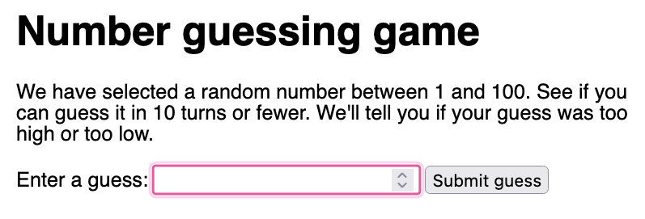

# Number Guessing Game

This is the [Number Guessing Game from MDN Webdocs Javascript lessons](https://developer.mozilla.org/en-US/docs/Learn/JavaScript/First_steps/A_first_splash).

## Table of contents

- [Overview](#overview)
  - [The challenge](#the-challenge)
  - [Screenshot](#screenshot)
  - [Links](#links)
  - [Built with](#built-with)
  - [What I learned](#what-i-learned) 
- [Author](#author)

## Overview

### The challenge
Create a simple guess the number type game. It should choose a random number between 1 and 100, then challenge the player to guess the number in 10 turns. After each turn, the player should be told if they are right or wrong, and if they are wrong, whether the guess was too low or too high. It should also tell the player what numbers they previously guessed. The game will end once the player guesses correctly, or once they run out of turns. When the game ends, the player should be given an option to start playing again.

### Screenshots

### Links
- Solution URL: [https://github.com/micamash/number-guessing-game]()
- Live Site URL: [https://micamash.github.io/number-guessing-game/]()

### Built with
HTML
CSS Javascript

### What I learned
I did this tutorial to gain some insight into how to integrate JS scripts into an HTML document.

## Author
- [My Github](https://github.com/micamash/)
- [MDN Web Docs](https://developer.mozilla.org/en-US/docs/Learn/JavaScript/First_steps/A_first_splash)
